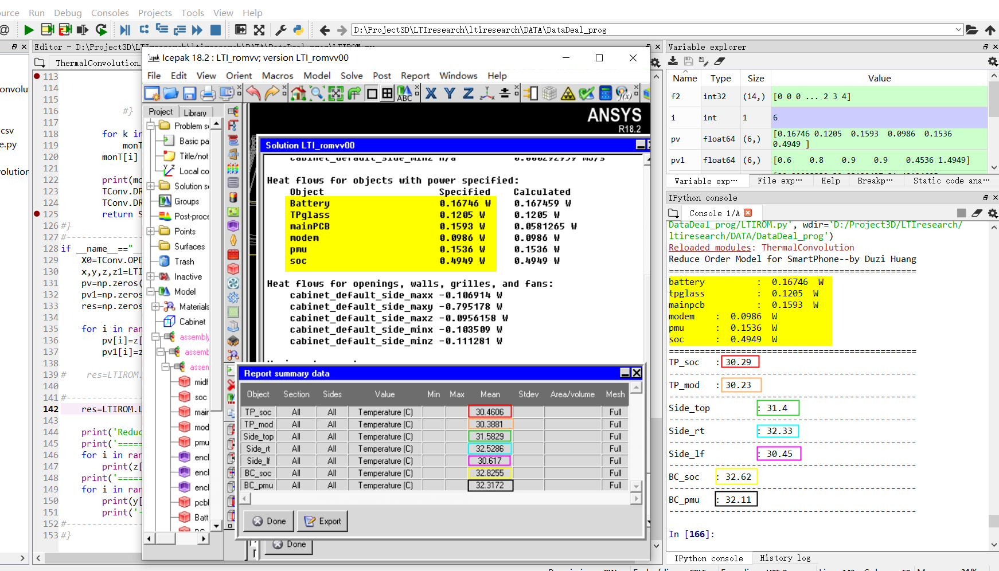
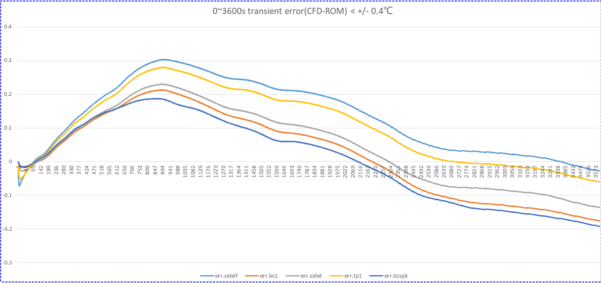
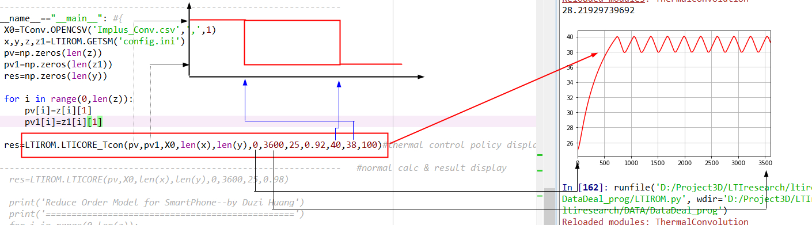

# Convolution-Thermal-ROM
A Thermal ROM method based on LTI &amp; convolution.

## CFD compare to CTROM
-for a steady state analysis, we see a difference between 0.5'C and using no more than 5secs for up to 6sources to 7 monitor points calculation.

=======================================================================================================

## A system level temperature control policy sim
-Evaluate your system level control policy in less than 5secs(with C code Library Accelarator)

-Currently, we will not open all source to public, just open some DEMO
